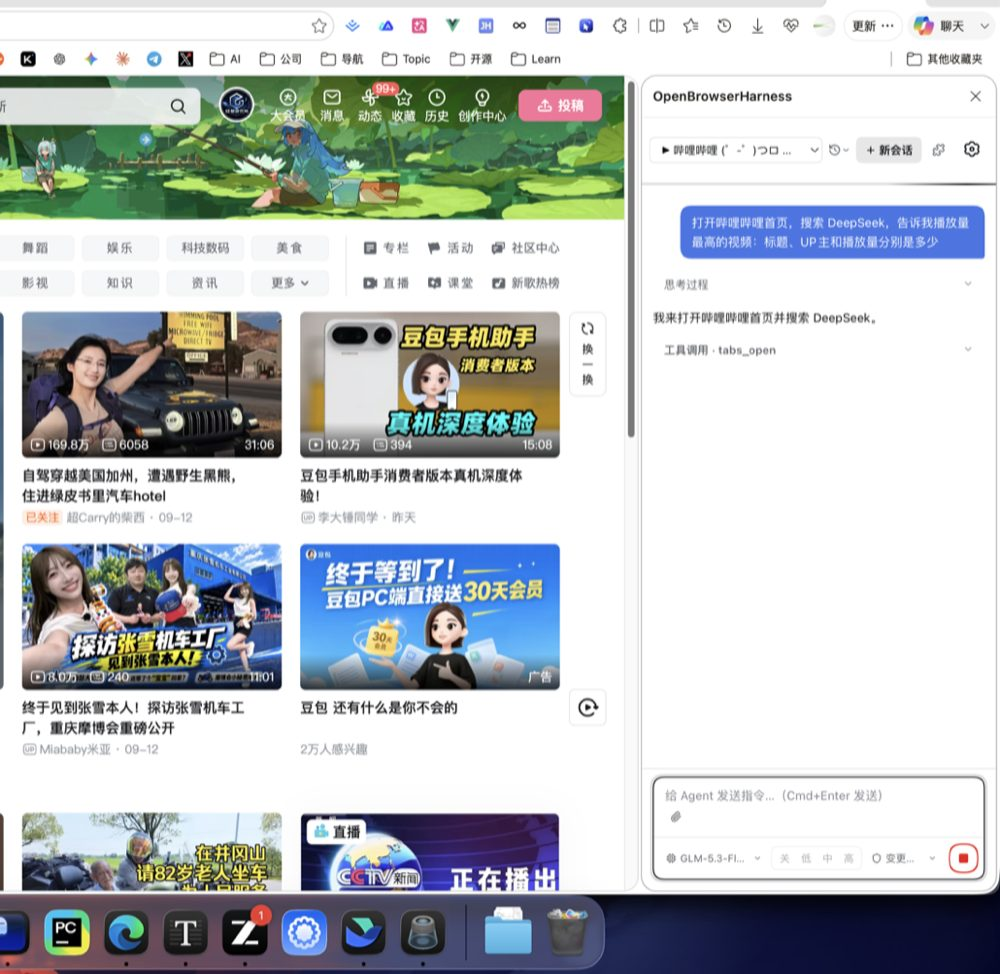
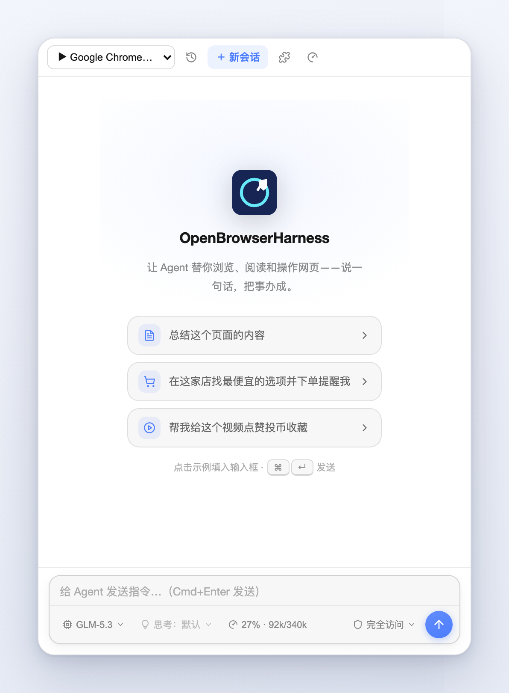
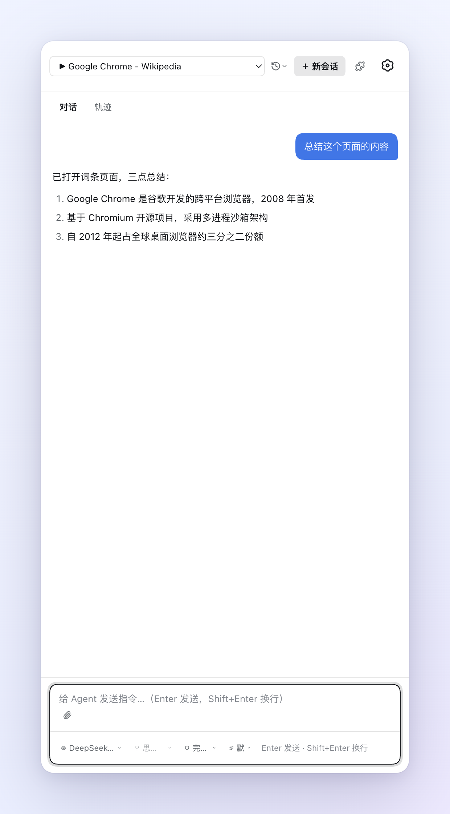

# OpenBrowserHarness

[English](README.md) | 中文

OpenBrowserHarness 是一个开源的**浏览器智能体扩展**（Chrome/Edge MV3）：完整的 agent harness 运行在浏览器里，替你驱动真实网页——导航、滚动、填表单、提取内容——输入拟人化、光标可视化，且全程受你审批。

<p align="center">
  <br>
  <em>真实任务执行中：「打开哔哩哔哩，搜索 DeepSeek，汇报播放量最高的视频」——agent 在页面上操作，工具调用实时流入侧边栏。</em>
</p>

<p align="center">
  
  &nbsp;&nbsp;
  
</p>

**本项目基于 [DeepSeek Harness](https://github.com/deepseek-ai/deepseek-harness)（dsh）二次开发**，是独立维护的 fork：把 dsh 引擎重新打包为浏览器扩展，并在其上新增了浏览器自动化能力层。详见[与上游的关系](#relationship-with-upstream)。

## 它能做什么

- **侧边栏里的智能体** —— 在 Edge/Chrome 侧边栏与 agent 对话；它规划任务、调用工具、记录待办、汇报结果。
- **拟人化浏览器控制** —— 贝塞尔鼠标轨迹带速度抖动、逐键输入、惯性滚动、落点抖动。通过 `chrome.debugger`（CDP）驱动，不依赖任何 OS 级自动化。
- **可视化虚拟指针** —— 霓虹彗星光标、运动拖尾、点击冲击波、打字/滚动脉冲直接渲染在页面上，每一步操作都看得见。
- **深度页面读取** —— 快照穿透 Shadow DOM 与 iframe；截图工具供多模态模型使用；页内脚本执行用于结果验证。
- **自带模型接入** —— DeepSeek、智谱 BigModel / GLM Coding Plan，以及任意 OpenAI 兼容端点、Anthropic 协议端点、本地 Ollama。密钥只存本地扩展存储。
- **控制权在你** —— 三档权限（每次确认 / 仅变更确认 / 完全访问）、逐操作审批卡、会话日志可导出审计。
- **dsh 完整特性** —— skills、计划模式、目标/待办、子代理、会话持久化——继承自 harness（见 [docs](docs/)）。

## 状态

早期开发者预览，会有破坏性变更。

## 安全须知

本扩展在你的 API Key 与登录态下驱动**真实网页**。交给它任务前先读 [SAFETY.md](SAFETY.zh.md)：agent 会在你指定的页面上点击、输入、提交——包括登录状态下的不可逆操作（下单、发帖、支付）。先在一次性页面上试，信任一个任务前把权限档位保持在**每次确认**，事后回看会话日志。模型供应商能看到 agent 发送的内容；除此之外没有任何遥测。

<a id="install-from-source"></a>

## 从源码安装

要求：Node.js ^22.19 或 ≥24，pnpm；Chrome/Edge ≥134（侧栏用到较新的 JS 特性）。

先构建扩展要打包的工作区 lib，再打包扩展：

```sh
git clone https://github.com/clear2x/openbrowserharness.git openbrowserharness
cd openbrowserharness
pnpm install
pnpm run build:lib
pnpm run build:extension
```

然后在 Chrome/Edge 打开 `edge://extensions`（或 `chrome://extensions`），开启**开发人员模式**，**加载解压缩的扩展**，选择 `apps/extension/dist`。打开侧边栏，在设置里选择供应商并填入 API Key。

## 仓库结构

保留 dsh monorepo 结构——总览见 [AGENTS.md](AGENTS.md)。扩展本体在 [`apps/extension`](apps/extension/README.zh.md)；`packages/` 与 `vendor/` 之下是继承的 harness。同级的 `apps/` 目录（`desktop`、`web`、`cli`）及其文档描述的是上游桌面／服务器部署形态，按原样继承——本扩展不使用它们，其中部分引用（下载主机、发布流水线）指向上游基础设施。

<a id="relationship-with-upstream"></a>

## 与上游的关系

- Fork 自 [deepseek-ai/deepseek-harness](https://github.com/deepseek-ai/deepseek-harness)（`0.1.0-rc.5`）；上游以 `upstream` remote 追踪。
- 内部 workspace 包沿用继承的 `@deepseek-ai/dsh-*` 命名（仅标识符——本项目不向 npm 发布任何包）。
- 为扩展宿主所做的上游修改登记于 [vendor/README.md](vendor/README.md)（vendored Cordis）与 `.agents/notes/` 树。

## 许可

[MIT](LICENSE)——第三方声明见 [THIRD_PARTY_NOTICES.md](THIRD_PARTY_NOTICES.md)。扩展隐私说明：[PRIVACY.md](PRIVACY.md)。
